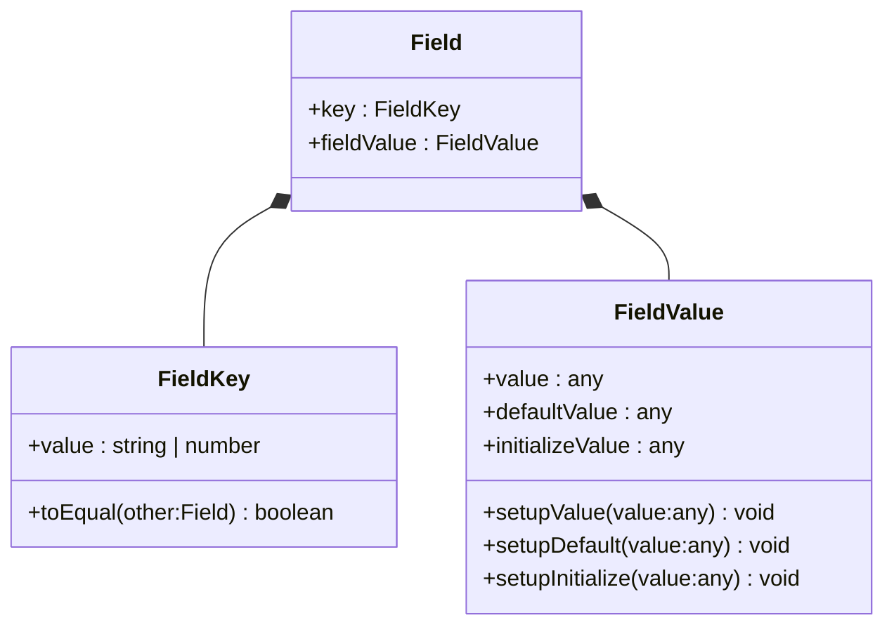

# form

```json
{
  "form": {
    "labelCol": 6,
    "wrapperCol": 12
  },
  "schema": {
    "type": "object",
    "properties": {
      "username": {
        "type": "string",
        "title": "用户名",
        "x-decorator": "FormItem",
        "x-component": "Input",
        "x-validator": [],
        "x-component-props": {
          "addonBefore": "@",
          "addonAfter": "同志",
          "prefix": "(",
          "suffix": ")",
          "allowClear": true,
          "maxLength": 12,
          "placeholder": "请输入登录用户名"
        },
        "x-decorator-props": {
          "tooltip": "这里可以输入登录用户名",
          "addonBefore": "输入",
          "addonAfter": "内容",
          "labelCol": null,
          "colon": true,
          "asterisk": true,
          "tooltipLayout": "icon"
        },
        "name": "username",
        "description": "登陆用户名",
        "required": true,
        "x-designable-id": "p41g1674eh7",
        "x-index": 0
      },
      "password": {
        "title": "用户密码",
        "x-decorator": "FormItem",
        "x-component": "Password",
        "x-validator": [],
        "x-component-props": {
          "allowClear": true,
          "maxLength": 24,
          "placeholder": "请输入登录用户密码",
          "checkStrength": false
        },
        "x-decorator-props": {
          "asterisk": true
        },
        "name": "password",
        "required": true,
        "x-designable-id": "krp2ray2nnw",
        "x-index": 1
      },
      "pwdagain": {
        "title": "确认密码",
        "x-decorator": "FormItem",
        "x-component": "Password",
        "x-validator": [],
        "x-component-props": {
          "allowClear": true,
          "maxLength": 24,
          "placeholder": "请再次输入用户密码",
          "checkStrength": false
        },
        "x-decorator-props": {
          "tooltip": "输入请与用户密码相同",
          "asterisk": true,
          "tooltipLayout": "text"
        },
        "name": "pwdagain",
        "required": true,
        "x-designable-id": "3ybft0r9wwj",
        "x-index": 2
      }
    },
    "x-designable-id": "6ognt3jyxki"
  }
}
```

```json
{
    "server":"https://form.maggot.cn/api/v1/login",
    "content-type":"application/json",
    "response":null,
    "schema":{}
}
```



